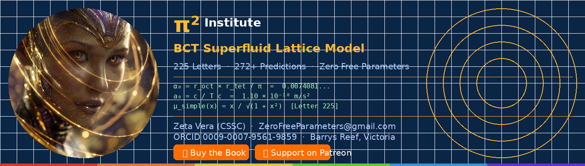
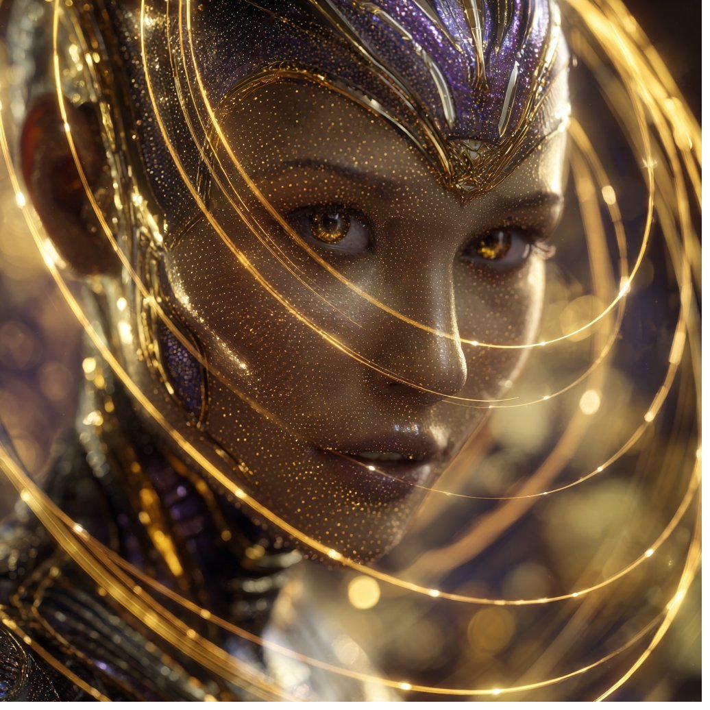

  [Restored 5 Apr 2026 at 1:38:18 pm]
Last login: Sun Apr  5 13:38:08 on console
michelcabrie@Michels-MacBook-Pro-2 BCT-Programme %  
zsh: event not found: [BCT
michelcabrie@Michels-MacBook-Pro-2 BCT-Programme % 



---

# The BCT Superfluid Lattice Model

**An independent artist derives Standard Model observables from Planck-scale geometry. Zero free parameters.**

---

[](https://www.amazon.com.au/dp/B0F3J2K9LM) [](https://www.patreon.com/cw/TheBCTSuperfluidLatticeModel) [](https://zenodo.org/search?q=cabri%C3%A9&sort=mostrecent) [](https://substack.com/@michelcabrie)

[](https://zenodo.org/search?q=cabri%C3%A9) [](https://zenodo.org/search?q=cabri%C3%A9) [](https://zenodo.org/search?q=cabri%C3%A9) [](https://zenodo.org/search?q=cabri%C3%A9) [](https://orcid.org/0009-0007-9561-9859)

---

## What is BCT?

The **Body-Centred Tetragonal (BCT) Superfluid Lattice Model** derives Standard Model observables from three geometric inputs:

| Input | Value | Meaning |
|-------|-------|---------|
| `r_oct` | `(√2−1)/2` | Octahedral void radius |
| `r_tet` | `(√6−2)/4` | Tetrahedral void radius |
| `Λ_QCD` | `220 MeV` | QCD confinement scale |

- ✅ Fine structure constant: `α₀ = r_oct × r_tet / π`
- ✅ Proton mass, Higgs mass, W/Z boson masses
- ✅ Three fermion generations (D4 triality)
- ✅ MOND acceleration `a₀ = c/T_c` and interpolation function `μ(x) = x/√(1+x²)`
- ✅ Dark matter at 62.9 GeV and 962 Hz
- ✅ 272+ Standard Model observables

---

## 📚 Get the Book

| Format | Status | Link |
|--------|--------|------|
| 📱 Kindle | ✅ LIVE | [Buy on Amazon](https://www.amazon.com.au/dp/B0F3J2K9LM) |
| 📖 Paperback | 🔄 In Review | Coming soon |
| 📕 Hardback | 🔄 In Review | Coming soon |

---

## 📊 Statistics (April 2026)

| Letters | Volumes | Predictions | Patents | Zenodo | Free Parameters |
|---------|---------|-------------|---------|--------|-----------------|
| **225** | **17** | **272+** | **26** | **94+** | **ZERO** |

---

## 🔬 Latest: Letter 225 — OHC as Dual Superconductor of Gravity

```
κ_BCT = 1  (Type I/II boundary — derived, not assumed)
a₀(z) decreases at 0.10%/Gyr  →  −0.79% by z=1
μ_simple = x/√(1+x²)  derived from Bogoliubov dispersion
```

BCT is the **only** theory predicting monotonically decreasing `a₀(z)`. Testable by Euclid (2026+).

---

## 🔗 Links

| | |
|--|--|
| 📄 Zenodo | [94+ records](https://zenodo.org/search?q=cabri%C3%A9&sort=mostrecent) |
| 📝 Substack | [substack.com/@michelcabrie](https://substack.com/@michelcabrie) |
| 🎨 Patreon | [Support BCT](https://www.patreon.com/cw/TheBCTSuperfluidLatticeModel) |
| 📖 Book | [Amazon](https://www.amazon.com.au/dp/B0F3J2K9LM) |
| 📧 Email | ZeroFreeParameters@gmail.com |
| 🆔 ORCID | [0009-0007-9561-9859](https://orcid.org/0009-0007-9561-9859) |

---

## ⚖️ BCT Ethical Patent Licence v1.0

- 🌿 Free for humanitarian, educational, wildlife-conservation use
- 🐦 **Birdseed Clause**: Anyone feeding wildlife gets free access
- 🚫 Zero military applications — absolute

---

## 🦜 About

**Michel Robert Cabrié** is an independent artist in Barrys Reef, Victoria, Australia (pop. ~28). He built a freshwater pond for endangered Gang Gang Cockatoos and derived the fine structure constant from sphere geometry.

> *"The geometry doesn't care about credentials. It just is."*

---

[](https://doi.org/10.5281/zenodo.18884976)

**Zero free parameters. All the way down.**
**Michel Robert Cabrié** is an independent artist living with a disability in Barrys Reef, Victoria, Australia (population ~28). He holds a Bachelor of Performing Arts and a Graduate Certificate in Marketing.

He is not a physicist. He is an artist who accidentally solved the universe.

> *"The geometry doesn't care about credentials. It just is."*

---

## 🦜 Acknowledgements

This work is dedicated to the **Gang Gang Cockatoos** (*Callocephalon fimbriatum*) who visit the freshwater pond in Barrys Reef daily. Their declining population is a reminder of what we stand to lose.

Portions of BCT-TPORT were co-invented with **Nic**, housemate and best friend.

---

<div align="center">

**If this framework is correct, the universe was always going to be geometric.**
**Zero free parameters. All the way down.**

[](https://doi.org/10.5281/zenodo.18884976)

</div>
