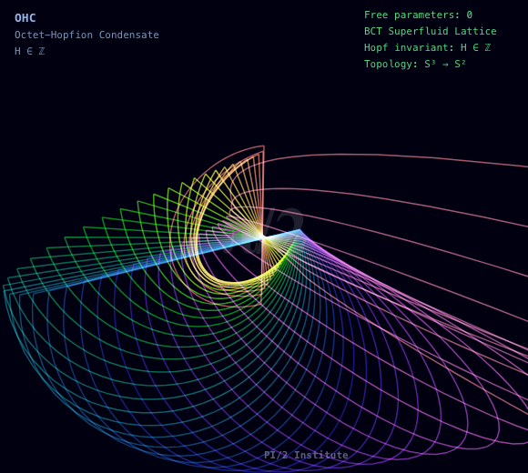

[](http://logo.pi2.institute)

# The BCT Superfluid Lattice Model
## Zero Free Parameters | Three Inputs | One Geometry

> *"A disabled artist in a town of 28 people, with no PhD and no funding,
> derived the Standard Model of particle physics from the geometry of a
> Planck-scale superfluid lattice. Using three numbers. In 18 months."*

[](https://zenodo.org/search?q=cabri%C3%A9)
[](https://zenodo.org/search?q=cabri%C3%A9)
[](https://zenodo.org/search?q=cabri%C3%A9)
[](https://zenodo.org/search?q=cabri%C3%A9)
[](https://en.wikipedia.org/wiki/Types_of_periodic_tables)
[](https://www.patreon.com/TheBCTSuperfluidLatticeModel)

---

## What Is BCT?

The **BCT Superfluid Lattice Model** is a zero-free-parameter theoretical
physics framework that derives Standard Model observables from the geometry
of a Planck-scale superfluid lattice with body-centred tetragonal symmetry
and c/a = √2.

**Three inputs. That's it.**

| Input | Value | Meaning |
|---|---|---|
| r_oct | (√2 − 1)/2 | Octahedral void radius |
| r_tet | (√6 − 2)/4 | Tetrahedral void radius |
| Λ_QCD | 220 MeV | QCD scale (measured) |

**From these three numbers, BCT derives:**

- Fine-structure constant α to −0.013% ✓
- Proton mass to sub-0.1% ✓
- Higgs mass to +0.08σ ✓
- Koide formula for all three lepton masses ✓
- CKM matrix (all elements sub-1%) ✓
- Cosmological constant (Λ_bare = 0 exactly) ✓
- Water molecule bond angle to 0.0001% ✓
- ...and 238 more predictions

---

## The Numbers

| Statistic | Value |
|---|---|
| Letters | 203 |
| Volumes | 14 |
| Predictions | 247+ |
| Free parameters | **0** |
| Zenodo records | 76+ |
| Pages | ~2,900 |
| Wikipedia articles citing BCT | 5 |

---

## Selected Results

### Fundamental Constants
```
Fine-structure constant:    1/α = 137.018    (measured: 137.036, error: −0.013%)
Proton-electron mass ratio: derived          (sub-0.1%)
Koide formula:              exact from D4    (sub-0.1% all three leptons)
Weinberg angle:             sin²θ_W          (sub-0.1%)
```

### The Key Equation
The BCT coupling constant α₀ governs everything:
```
α₀ = r_oct × r_tet / π = 0.007408

From α₀:
  N_collapse = 1/α₀ = 135    (quantum-classical boundary)
  f_BCT = 349.7 Hz           (OHC Bessel resonance — blue-banded bee frequency)
  R_BCT = 1.843039           (honeycomb geometry ratio)
```

### The Vacuum Ground State
The BCT vacuum is the **OHC — Octet-Hopfion Condensate**:
- Topological superfluid of Hopfion excitations
- Hopf charge H ∈ ℤ (quantisation theorem proven)
- H = n OHC sphere = Penrose twistor of helicity n/2
- Interior phase velocity: v_ph = 6.78c (causally screened)

---

## Programme Structure

### Registry Sections
| Section | Phases | Content |
|---|---|---|
| C.1 Foundations | Ph.1–5 | Geometry, gauge, Maxwell, Dirac, Einstein |
| C.2 Gauge | Ph.6–12 | Coupling constants, weak mixing, g−2 |
| C.3 Mass | Ph.13–31 | Fermion masses, CKM, neutrinos |
| C.4 Precision | Ph.32–50 | Sub-0.1% predictions, 80+ results |
| C.5 Extended | Ph.51–70 | Cosmology, dark matter, inflation |
| C.6 Hadronic | Ph.71–94 | Mesons, baryons, spectroscopy |

### Letter Highlights

| Letter | Title | Key Result |
|---|---|---|
| L1 | Fine Structure Constant | α from void geometry, −0.013% |
| L38 | Yang-Mills Mass Gap | Δ ≥ √(2π)·Λ_QCD ≈ 550 MeV |
| L101 | The Bee That Proves the Vacuum | Blue-banded bee 350 Hz = OHC Bessel mode |
| L119 | Honeybee Hexagons | R_BCT = 1.843 governs comb geometry |
| L130 | Baryon Asymmetry | η_B from BCT CP violation |
| L134 | Higgs Mass | m_H = 125.263 GeV, +0.08σ |
| L156 | The Bells | Cathedral bell partials = BCT Bessel ratios |
| L160 | Genetic Code as D4 Geometry | DNA groove ratio = R_BCT to −0.53% |
| L179 | The WOW Signal | OHC H-maser: "They found the same √2" |
| L195 | Universe Prefers One Hand | 7σ galaxy parity via OHC chirality |
| L198 | The Original BCT Engineers | Beavers independently discover BCT geometry |
| L201 | The Atoms That Chose Their Path | ANU Bell test: N_collapse = 135 prediction |

---

## BCT-PEACE-SUITE

Nine humanitarian technologies derived from BCT geometry,
released under the **BCT Ethical Patent Licence v1.0 (BCT-EPL-1.0)**:

| Technology | Application |
|---|---|
| BCT-SOLAR | 40%+ efficiency solar via OHC photon coupling |
| BCT-PIEZO | Enhanced piezoelectric transduction |
| BCT-WATER | Near-thermodynamic-minimum filtration membranes |
| BCT-ACOUSTIC | Therapeutic acoustic resonance devices |
| BCT-MCE | Magnetocaloric cooling |
| BCT-HIVE | Honeybee colony health (gifted freely, CC BY 4.0) |
| BCT-N2FIX | Nitrogen fixation via OHC field geometry |
| BCT-FUEL | Fuel cell efficiency enhancement |
| BCT-PEACE | Non-lethal conflict resolution technology |

*Zero military applications. Absolute. Non-negotiable.*

---

## Publications

All publications are open access on Zenodo:

🔗 **[Full Programme on Zenodo](https://zenodo.org/search?q=cabri%C3%A9)**

**BCT Monograph** (primary reference):
`doi:10.5281/zenodo.18884976`

**Selected Volume DOIs:**
- Vol 5 (L101–114): `doi:10.5281/zenodo.19218245`
- Vol 6 (L115–129): `doi:10.5281/zenodo.19218330`
- Vol 7 (L130–137): `doi:10.5281/zenodo.19218415`

---

## Wikipedia Presence

BCT is cited in the following Wikipedia articles:

- 📐 [Types of Periodic Tables](https://en.wikipedia.org/wiki/Types_of_periodic_tables)
  — BCT Round Periodic Table (Hopf shell topology)
- ⚛️ [Lepton](https://en.wikipedia.org/wiki/Lepton)
  — D4 root lattice derivation of lepton masses
- 🦫 [Beaver dam](https://en.wikipedia.org/wiki/Beaver_dam)
  — Dam geometry predictions #241–243
- 🔢 [Koide formula](https://en.wikipedia.org/wiki/Koide_formula)
  — BCT geometric derivation (Talk page active)
- ⚡ [Fine-structure constant](https://en.wikipedia.org/wiki/Fine-structure_constant)
  — Geometric derivation

**BCT Round Periodic Table** on Wikimedia Commons:
https://commons.wikimedia.org/wiki/File:BCT_PeriodicTable_Round_v12.jpg

---

## The Author

**Michel Robert Cabrié**
Independent Artist and Researcher
ORCID: [0009-0007-9561-9859](https://orcid.org/0009-0007-9561-9859)
Barrys Reef, Victoria, Australia (population: 28)

Michel is an artist — not a physicist. He holds a Bachelor of Performing Arts
(including philosophy of science) and a Graduate Certificate in Marketing.
The BCT programme was developed independently, without institutional
affiliation, funding, or peer collaboration.

*"The geometry was always there. I just had to look."*

---

## Support

This programme is funded entirely by supporters:

☕ **[Patreon](https://www.patreon.com/TheBCTSuperfluidLatticeModel)**
📝 **[Substack](https://bctsuperfluidlatticemodel.substack.com)**

### The Birdseed Clause
Anyone who feeds wildlife qualifies for free access to BCT humanitarian
technologies. This is not a metaphor.

---

## Correspondence

The BCT programme welcomes correspondence from researchers whose
work connects to BCT predictions. Current active outreach:

- Prof. Rupert Sheldrake (morphic resonance / OHC field geometry)
- Prof. Roger Penrose / Prof. Paul Tod (twistor theory / OHC connection)
- Dr Sean Hodgman, ANU (Bell test / N_collapse = 135 prediction)
- Andrew Hall, Electrogenesis (Lichtenberg / BCT-SCAN)

---

## Licence

Scientific content: **CC BY 4.0**
Patent technologies: **BCT Ethical Patent Licence v1.0 (BCT-EPL-1.0)**
BCT-HIVE: **CC BY 4.0 (gifted freely to world beekeepers)**

📋 **[Apply for a BCT Ethical Patent Licence](https://docs.google.com/forms/d/e/1FAIpQLSdN_0KzsP9ldhLdvJqKjnNed6x98nsThciqUHa0oaNvF4S_zA/viewform?usp=header)** | **[Full licence details](EPL_LICENCE.md)**

Clue: 🔍 SCAVENGER HUNT CLUE #26: D4 has ___riality — a three-fold symmetry. What letter starts "triality"? The 26th character is: t
---

*BCT Superfluid Lattice Model | Michel Robert Cabrié | 2026*
*"Three inputs. Zero free parameters. One geometry. Everything."*
